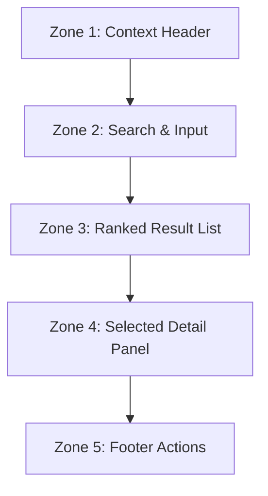
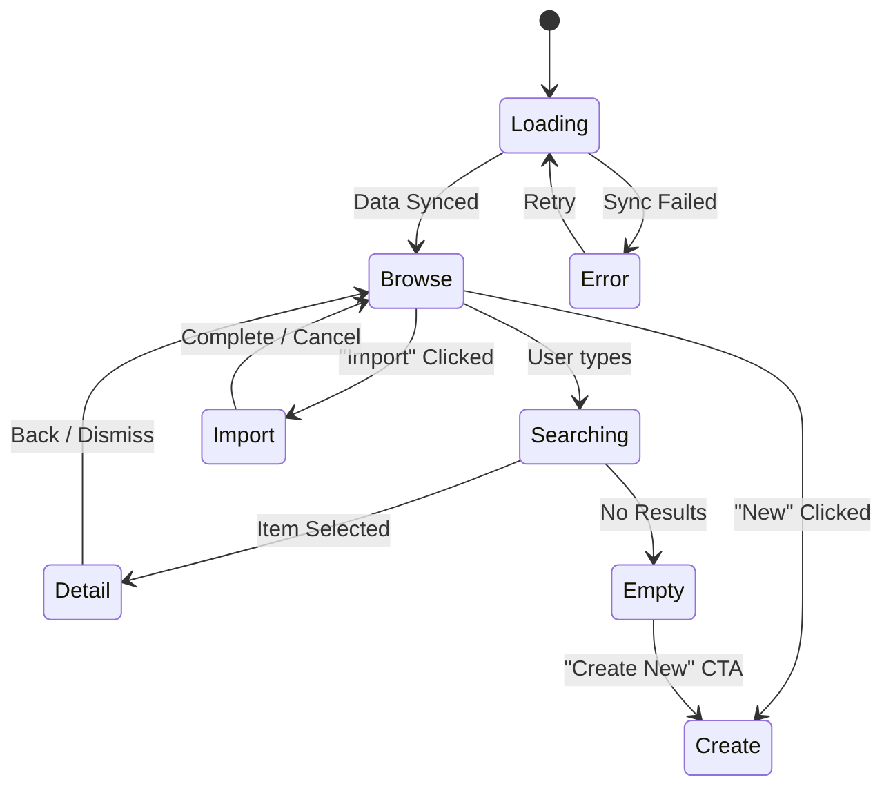

# Dictionary Sidecar: Information Architecture & Interaction Model

**Issue:** #181
**Parent Feature:** #83 [Feature] Intelligent Dictionary Sidecar
**Parent Epic:** #39 [Epic] Multi-Language Dictionary Support (eCOA)

## 1. Objective
Define a robust Information Architecture (IA) and interaction model for the Intelligent Dictionary Sidecar to ensure seamless clinical terminology authoring. The sidecar must balance local workbook data with external standards (CDISC Library) while maintaining strict context awareness of the user's Excel cursor.

## 2. Information Architecture (The 5 Zones)

The sidecar is organized into five authoritative vertical zones, ensuring that critical context is never lost during navigation.

### Zone 1: Context Header (Always Visible)
*   **Purpose:** Anchors the sidecar to the Excel workbook.
*   **Content:**
    *   Active Sheet Name (e.g., `AE`, `VS`).
    *   Active Field/OIT (e.g., `AESEV`).
    *   Current Value (if cell is not empty).
*   **Behavior:** Updates in real-time via `Workbook Selection Synchronization` (#165).

### Zone 2: Search & Input
*   **Purpose:** Entry point for finding terminology.
*   **Content:** Unified search bar with "Global Search" toggle.
*   **Behavior:**
    *   Auto-suggest based on field name in Zone 1.
    *   Supports CDISC OIDs, synonyms, and decoded text.

### Zone 3: Ranked Result List
*   **Purpose:** Provides a prioritized list of potential matches.
*   **Grouping:**
    1.  **Workbook Matches:** Codelists already present in `_Codelists`.
    2.  **Standard Matches:** Matches from CDISC Library (requires import).
    3.  **Heuristic Matches:** Fuzzy matches based on label similarity.

### Zone 4: Selected Detail Panel
*   **Purpose:** Deep-dive into a specific codelist before application.
*   **Content:**
    *   Full list of Coded Values and Decodes.
    *   Multilingual preview (Tabbed by locale).
    *   Metadata (Source, Version, OID).

### Zone 5: Apply / History / Footer Actions
*   **Purpose:** Finalizing the interaction.
*   **Actions:**
    *   `Use / Apply`: Write Codelist ID to the active cell.
    *   `Import`: Bring external CDISC package into the workbook.
    *   `Create New`: Launch the manual codelist builder.

---

## 3. State Machine

The sidecar transitions between these states based on user interaction and Excel telemetry.

### State Definitions
| State | Description | Primary UI Elements |
| :--- | :--- | :--- |
| **Empty** | No matches found for current search/context. | Empty state illustration, "Create New" button. |
| **Loading** | Fetching data from Excel or CDISC API. | Fluent UI Spinner, "Syncing..." text. |
| **Browse** | General listing of workbook codelists. | DataGrid, Search bar (inactive). |
| **Searching** | Filtered results based on active input. | Ranked List (Groups), Highlighted text. |
| **Detail** | Inspection of a specific codelist. | Detail Table, Language switcher, "Use" button. |
| **Create** | Manual entry form. | Multi-row input grid for values/decodes. |
| **Import** | CDISC Library browsing & conflict resolution. | Package list, Progress bar, Conflict resolver. |
| **Error** | Network or API failure. | MessageBar (Intent: Error), Retry button. |

---

## 4. Interaction Model

### Keyboard-First Workflow
To maintain high-velocity data management, the sidecar must support full keyboard navigation:
*   `Cmd/Ctrl + Shift + D`: Open/Focus Sidecar (Shortcut handled by Office.js).
*   `Arrow Up/Down`: Navigate through the result list.
*   `Enter`: Select item and open Detail view.
*   `Alt + Enter`: Immediately "Use" selected item without opening detail.
*   `Esc`: Return to Browse or clear search.
*   `Tab`: Move between zones (Search -> List -> Footer).

### Search & Ranking Logic
1.  **Exact ID Match:** Codelist IDs matching the cell context or search string exactly.
2.  **Label Match:** Similarity between the search string and `Codelist Name` or `Decode` values.
3.  **Historical Usage:** Frequency of use within the current study.

### Workbook Synchronization
*   **Trigger:** Cell selection change in any CRF sheet.
*   **Logic:**
    *   If column is "Codelist ID": Sidecar expands/focuses.
    *   If column is not "Codelist ID": Sidecar remains in background or collapses (depending on Pin state).

---

## 5. Design Constraints
*   **Width:** Must remain functional at 300px (standard Excel taskpane width).
*   **Scroll:** Zone 1 & 2 remain fixed; Zone 3 & 4 are scrollable.
*   **Persistence:** Search term and scroll position are reset on sheet change, but preserved on cell change within the same sheet.
